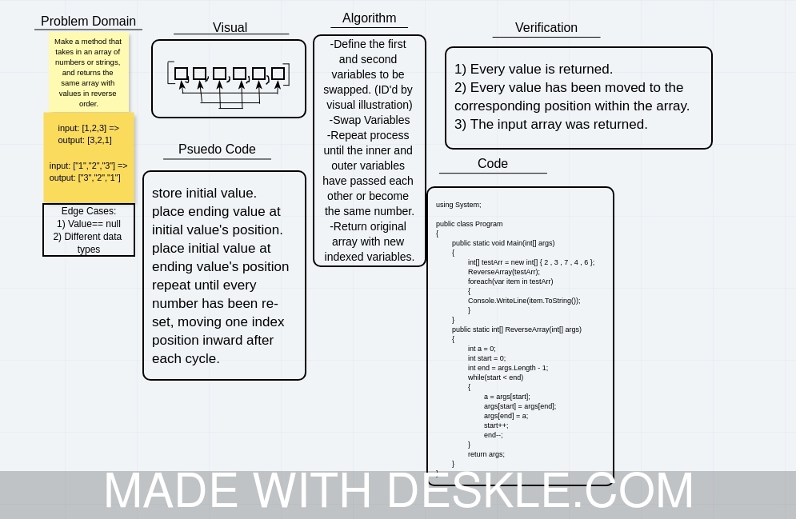
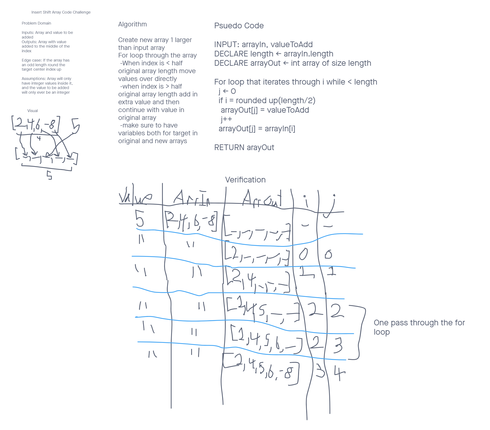
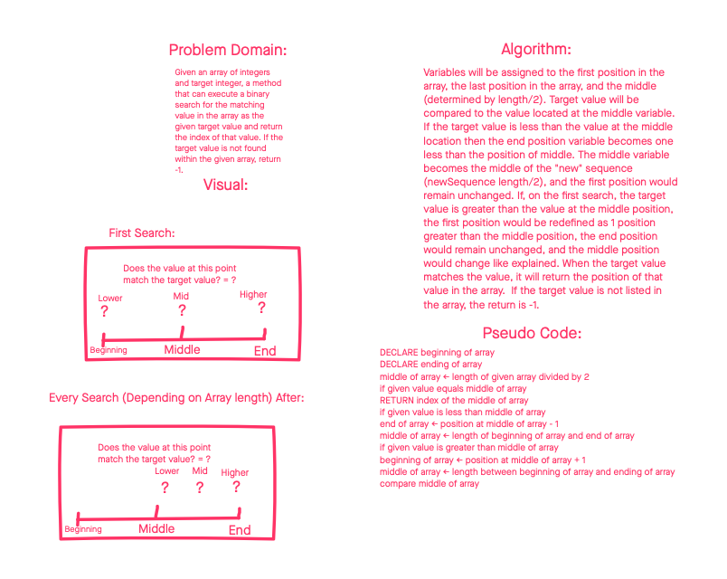
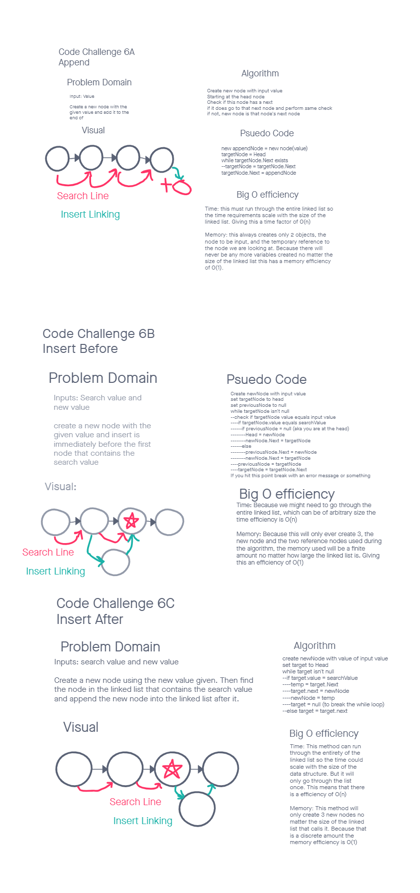

# Reverse an Array
Whiteboard a method that will take an array and reverse the order of the objects without making a new array or using any pre-made methods

## Whiteboard Process

## Approach & Efficiency
We used the whiteboard from the heroku virtual classroom and then used an online C# editor to write and test the code.

<!--Break Between Whiteboards -->

# Insert to Middle of an Array
Whiteboard a method that will take an array and a value and insert that value into the middle of the array with a prefference on odd length arrays to put the new value farther back rather than closer to the front.

## Whiteboard Process

## Approach & Efficiency
The big o efficiency for this is O(1) I think. That is more due to the simplicity of the task (looping through an array once) than it is the elegance of the solution but I will take it.

<!--Break Between Whiteboards -->

# Binary Search of Sorted Array
Given an array of sorted integers, and a value to find in that array, use the binary search method to efficiently search through the array.

## Whiteboard Process

## Approach & Efficiency
The approach taken was the standard binary search method, there was an included infographic that showed us how to do the algorithm. 
The time requirement of this search is much less than just looping through the array. I beleive the time efficiency to be O(logn). It is not O(n) because as I understand it that would be the efficiency of just searching through the arrary.
The space efficiency is very good. There are only 3 variables created and no new arrays, so an efficiency of O(n) because the array still takes up space.

<!--Code Challenge 05 Linked Lists Implementation -->

# Singly Linked List
This challenge involved creating custom linked list and node classes. 
The nodes only need a next node refference and an integer value. 
The linked list needs the ability to insert new values into nodes on the list, check if a given value is included, and output a string representation of the string.

## Challenge
The further challenge was creating test to verrify all of the tests detailed below.
- Can successfully instantiate an empty linked list
- Can properly insert into the linked list
- The head property will properly point to the first node in the linked list
- Can properly insert multiple nodes into the linked list
- Will return true when finding a value within the linked list that exists
- Will return false when searching for a value in the linked list that does not exist
- Can properly return a collection of all the values that exist in the linked list

## Approach & Efficiency
For all of the methods that involve acutally looping through the array I used a while loop.
This only goes through the linked list once for each method so the time efficiency is O(1) because it happens a set number of times.
For memory efficiency the memory space needed will be directly proportional to the size of inputs give to the linked list giving it an efficiency of O(n)

## API
Node methods
Next: Define the Node that this Node's link ties to
Value: Give the value to be stored in the node

Linked List Methods
Head: The initial node in the linked list
Insert: Give a value in, and then have a Node created and added to the start of the linked list
Include: Given a value look through the linked list and return true if that value is found in any of the nodes
MakeString: Return a string that represnts the linked list

<!--Code Challenge 06 Linked Lists Insertion Methods -->

# Append
Given a value create a node and add it to the start of the linked list

#Insert Before
Given a target to search for and an input value, create a node with that input value 
and put that node just before the first node that contains the search variable.

#Insert Answer
Given a target to search for and an input value, create a node with that input value 
and put that node just after the first node that contains the search variable.

## Whiteboard Process

## Approach & Efficiency
Time: All of these methods only loop through the linked list once. This means the time will scale linearly 
with the size of the linkedlist that runs the method, giving it an efficiency of O(n).
Memory: All of these methods only create and refference a set number of nodes for the entire methods. Because
this does not scale to the size of the linked list the memory effieciency is O(1).
