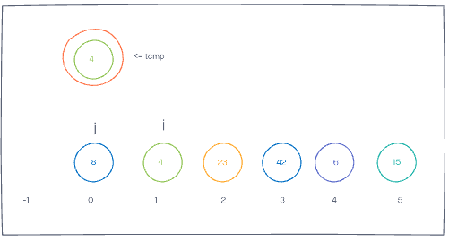
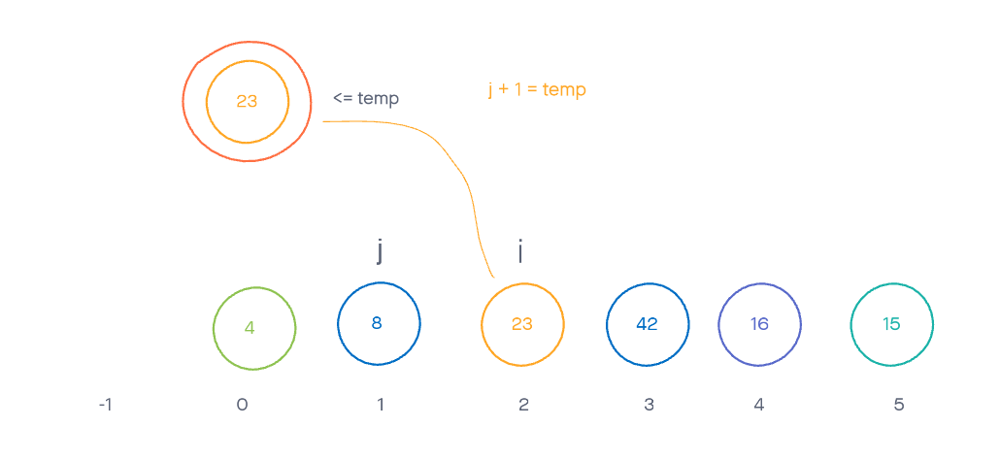
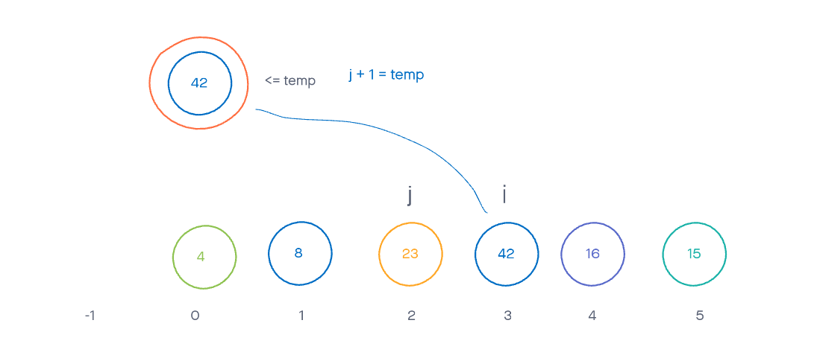
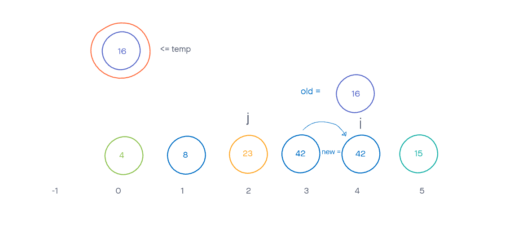
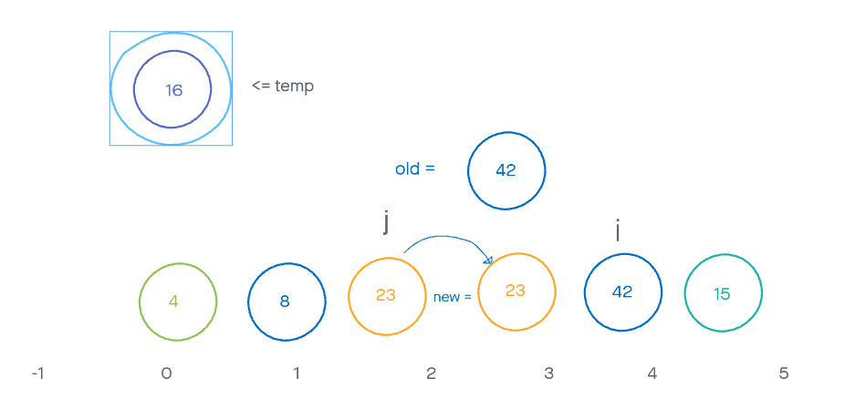
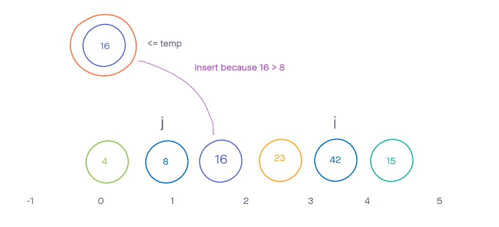
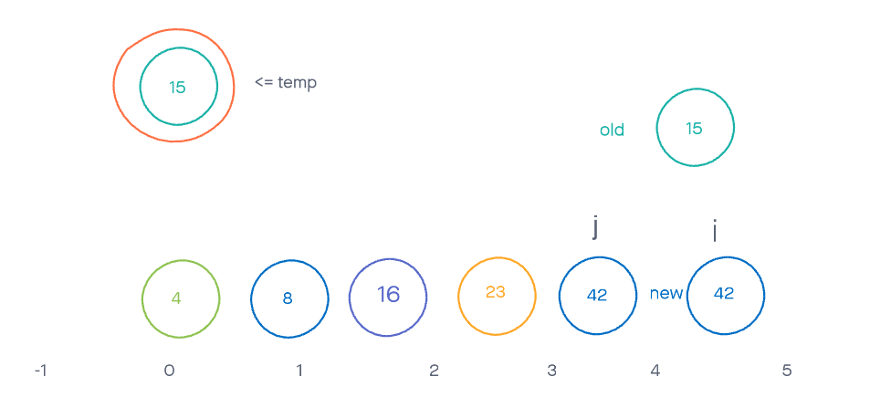
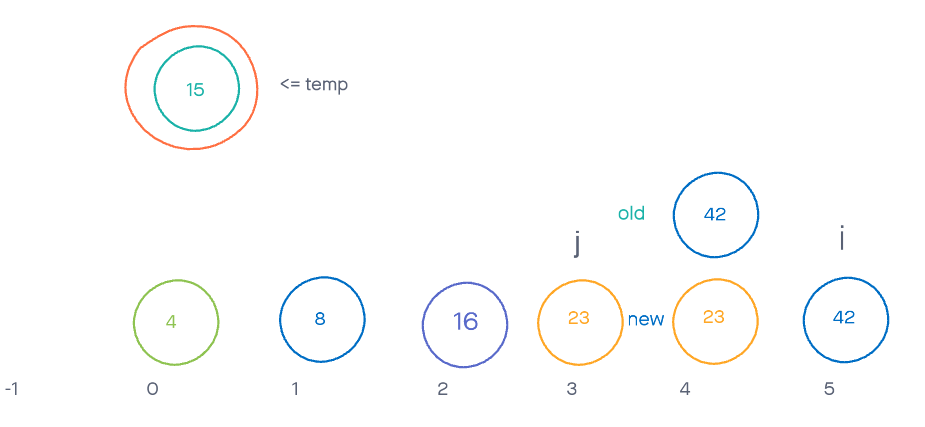
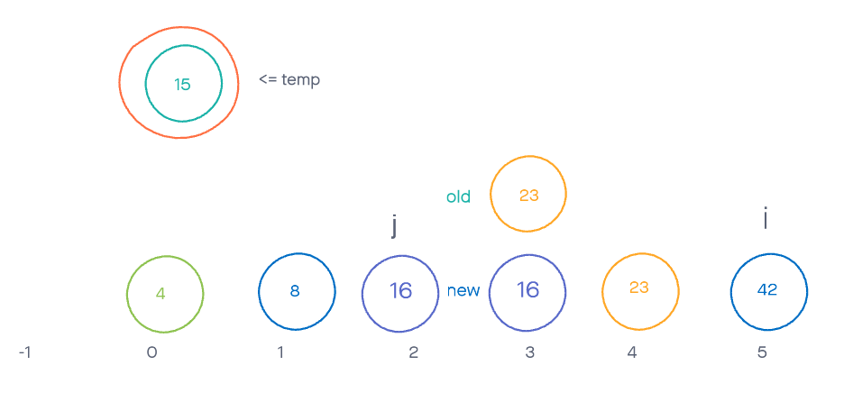
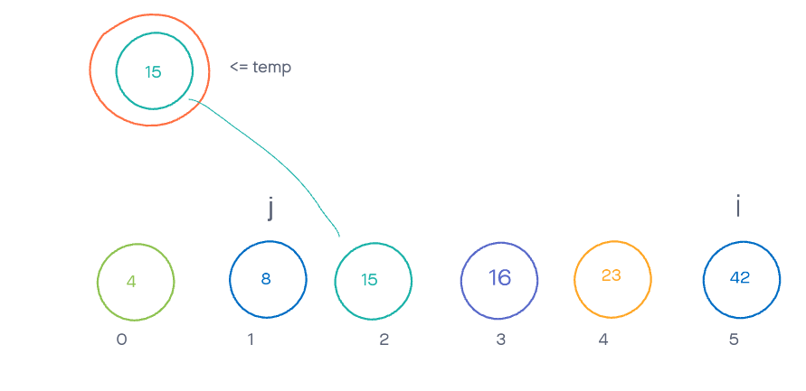

# Insertion Sort BLOOOOOOOG

By Charles Bofferding and Jonah Brown

## Problem Domain

Implement a method that takes in an array of integers and returns the array with the values sorted from smallest to largest.

## Provided Psuedo Code

``` cs
InsertionSort(int[] arr)

    // For every variable in 
    For i = 1 to arr.length{ 
        //setting j to 1 behind i.
        int j = i - 1

        int temp = arr[i]

        // While our backwards counting j is not negative in the index and the temp variable is lesser than 
        // the current value of j, keep moving the values forward in the line.
        while j >= 0 and temp < arr[j]
        {
            arr[j + 1] = arr[j]
            j--
        }
        // Finally, set the value of temp to the value of j + 1 and repeat the loop.
    }

``` 

## Process

We start out all of the variables in their initial positions for the first time through the for loop



Next because j >=0 and temp (4)< arr[j] (8) we enter the while loop

We move the value at index j to the index j+1, and then decrement j (-1)

Now because j >= 0 is not true we break the while loop and set the index of j+1 (0) to temp

We now increment i and enter the next iteration of the for loop



Now we move to the while loop, but because temp (23) < arr[j] (8) is not true we do not change anything

arr[j+1] is set to temp, but that is putting back the original value so there is no change in the array

We now increment i and enter the next iteration of the for loop



Now we move to the while loop, but because temp (42) < arr[j] (23) is not true we do not change anything

arr[j+1] is set to temp, but that is putting back the original value so there is no change in the array

We now increment i and enter the next iteration of the for loop

Now we move to the while loop, because temp (16) < arr[j] (42) we move the value at arr[j] (42) to the next location at arr[j+1] and decrement j



Because temp (16) < arr[j] (23) we move the value at arr[j] (23) to the next location at arr[j+1] and decrement j



but because temp (16) < arr[j] (8) is not true we do not change anything, break out of the while loop, and arr[j+1] is set to temp (16)




So we start back into our for loop with i incremented. Setting up for the while loop with j = i-1 (4) and temp equal to arr[i] (15)

Then we move to the while loop. Because temp (15) < arr[j] (42) we set the value stored at arr[j] into the array one index forward and decrement j



Because temp (15) < arr[j] (23) we set the value stored at arr[j] into the array one index forward and decrement j




Because temp (15) < arr[j] (16) we set the value stored at arr[j] into the array one index forward and decrement j



Now because temp (15) < arr[j] (8) is not true we break out of the while loop and place the value of temp into the array at index j+1



Now because incrementing incrementing the value of I makes it larger than the array length the sort is done.