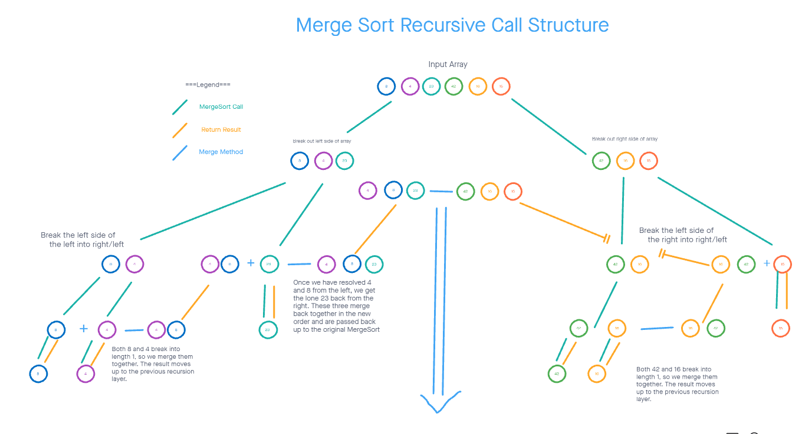
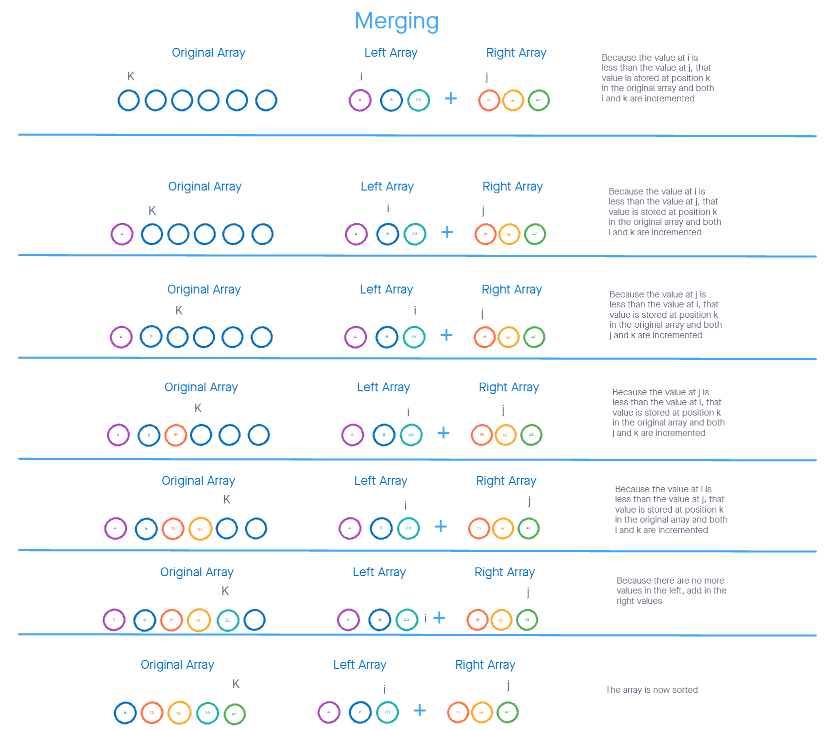

# Merge Sort BLOOOOOOOG

By Charles Bofferding and Steven Boston

## Problem Domain

Implement a method that takes in an array of integers and returns the array with the values sorted from smallest to largest.

## Provided Psuedo Code

``` cs
        public static void MergeSort(int[] arr)
        {
            int n = arr.Length;

            if (n > 1)
            {
                int mid = n / 2;
                int[] left = arr[0..mid];
                int[] right = arr[mid..n];

                MergeSort(left);

                MergeSort(right);

                Merge(left, right, arr);
            }
        }

         public static void Merge(int[] left, int[] right, int[] arr)
        {
            int i = 0;
            int j = 0;
            int k = 0;

            while (i < left.Length && j < right.Length)
            {
                if (left[i] <= right[j])
                {
                    arr[k] = left[i];
                    i++;
                }
                else
                {
                    arr[k] = right[j];
                    j++;
                }
                k++;
            }

            if (i == left.Length)
            {
                while (j < right.Length)
                {
                    arr[k] = right[j];
                    k++;
                    j++;
                }
            }
            else
            {
                while (i < left.Length)
                {
                    arr[k] = left[i];
                    k++;
                    i++;
                }
            }
        }

``` 

## Process

This method can be broken down into two main components. The first half is the recursive first half, it will continue to break an array down into 
the left and right halves continually until the input array has a length of 1. This is done so that when you are comparing just two values you
can have them easily compared and then know that you have an ordered array. Below is an image showing the process of dividing up an array
with six values.



Now when trying to combine the different arrays it is initially very easy. When the left and right array are only 1 item each the simple
comparison can be made. Below is an example of a merge step by step when we are merging together the two three length arrays. Because this 
is the most complicated merge it is the one that we will be stepping through.



At each step you compare the values at the I and J locations. Whichever is smaller is placed into the K location in the original array.
Then both K and the indicator with the smaller value are incremented to continue through the arrays. If ever one of the array indicators
goes past the length of the array all of it's values have been inputed and the method will just add in all the remaining values from the
other array to be merged.