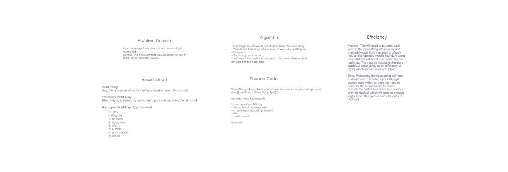

# HashMap Repeated Word

## Challenge
Implement a method that takes in a string of text and returns the first repeated word in that string regardless of case sensitivity. If no 
repeated words are found return null (the prompt didn't say what to do in that case so a null return is my assumption)

## Approach & Efficiency
The approach is process the input string into an array of words which all have been changed to lower case. Then create a hashmap. Finally start
going through each word in the processed array and first check if it is in the hashmap. If it isn't place it in, if it is already in there that
is your first repeated word and return that. If you get through all of the possible words and find no repeates return null.

Memory Efficiency: O(n)
Time Efficiency: O(nlogn)

## API
RepeatedWord: Input a string to receive back a string which is the first word that was repeated, but with all the letters lower case and without and 
special characters
ProcessString: INput a string to have an output array of all of the words in that string to lower case and without any special characters